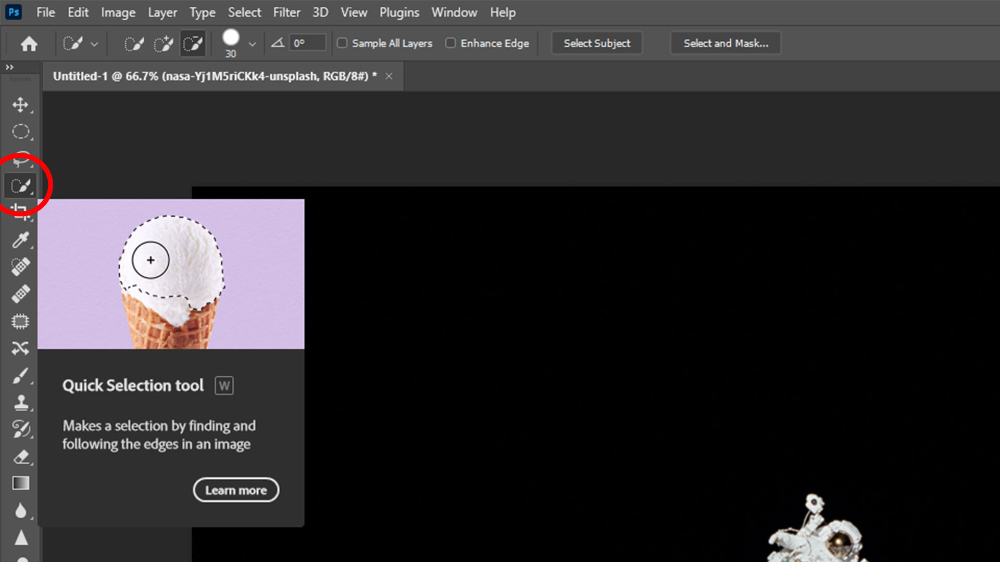
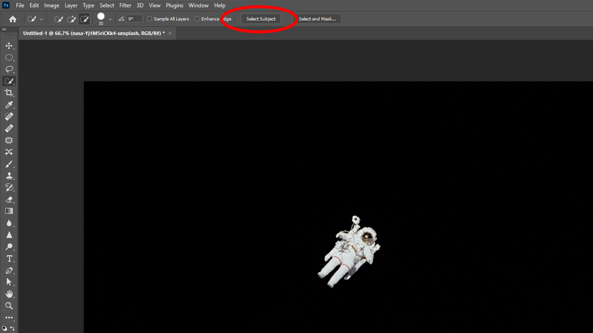
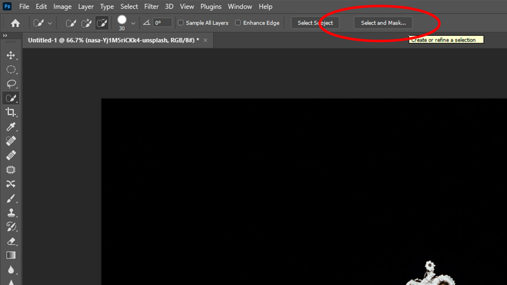
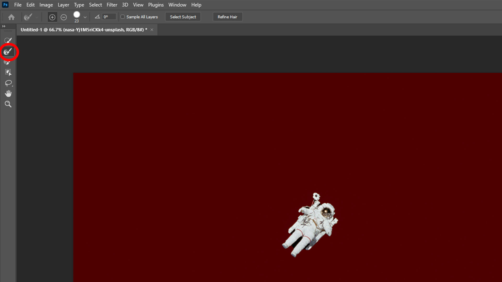
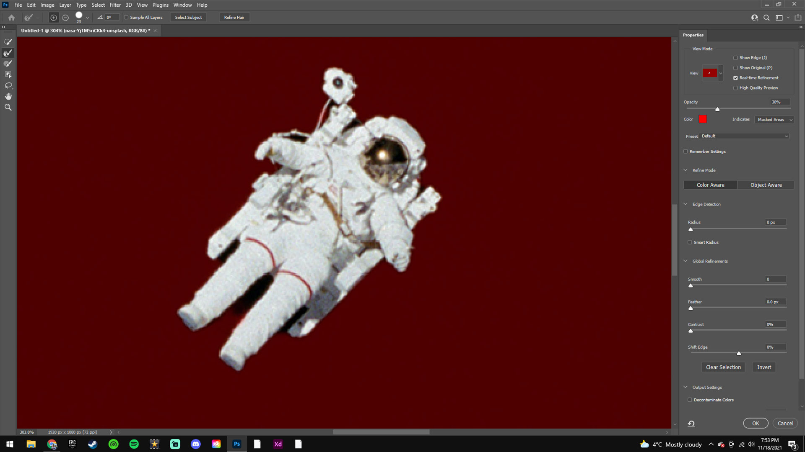
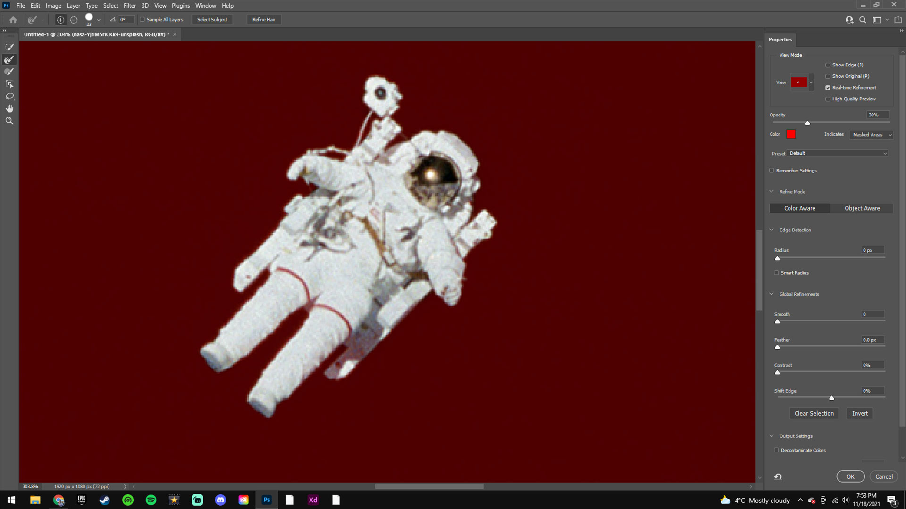
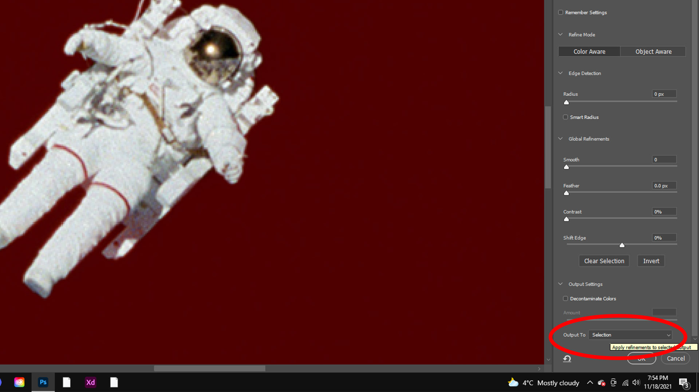
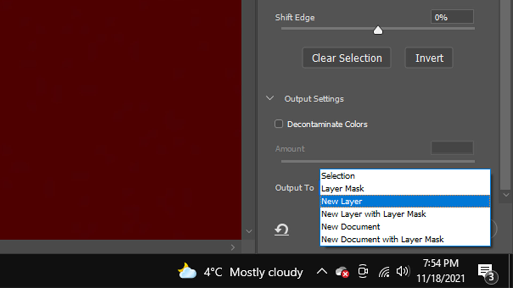

# Comment détouré un sujet sur Photoshop

## 1: Sélectionner l'outil de sélection rapide (W)

## 2: Appuyer sur la touche : "sélectionner un sujet"
#### Attendre ensuite que des lignes pointillées apparaissent

## 3: Appuyer sur la touche "sélectionner et masquer"
#### Attendre ensuite que le menu apparaisse

## 4: Sélectionner l'outil d'amélioration des contours (R)
#### Il est préférable de prendre une petite taille de pinceau pour être plus précis

## 5: Utiliser l'outil sur tout les endroits mal détourer
#### Les endroits où des imperfections sont visibles

## 6: Le résultat devrait ressembler à ça

## 7: Appuyer sur la touche "sélection"
#### Le menu va ensuite se dérouler

## 8: Choisir l'option "nouveau calque"
#### Cela va permettre d'implanter directement le sujet dans le projet

# Bravo !!!
## Tu es maintenant un professionel du détourage de sujet dans Photoshop
